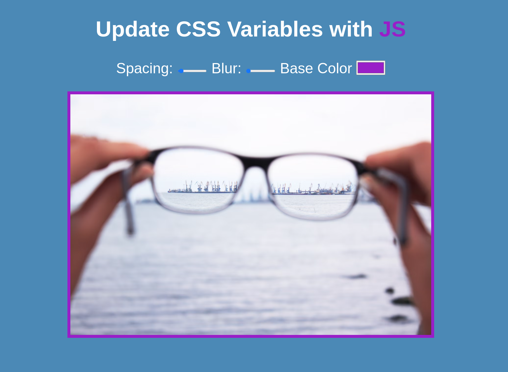

Welcome! 

Come join me on my journey of Wes Bos's 30 Day Vanilla JS Code Challenge! Where I build 30 things in 30 days with 30 tuturials~
<br></br>
### Day 3 Challenge of Javascript30

## CSS Variables
---- 
Playing around with CSS~ Uses CSS to let users choose space & colour for the border and lets them blur the image. 



Demo: 


----
### What I learned/refresher:
- variables
  - Like with SASS, you can create variables for use throughout your stylesheet.
  ```js
  /* Definition */
  --base: #fffff;

  /* Use */
  .hl {
    color: var(--base);
  }
  ```
- dataset
  - Can be used to access data attribute values given to HTML elements. These data elements must be prefixed with data-
  - Example: 
  ```js 
  <input id="spacing" type="range" name="spacing" min="10" max="200" value="10" data-sizing="px">
   ```
   - then can be accessed like this:
   ```js
   const suffix = this.dataset.sizing;
   ```


Starter code from [Javascript 30 Challenge](https://github.com/wesbos/JavaScript30)